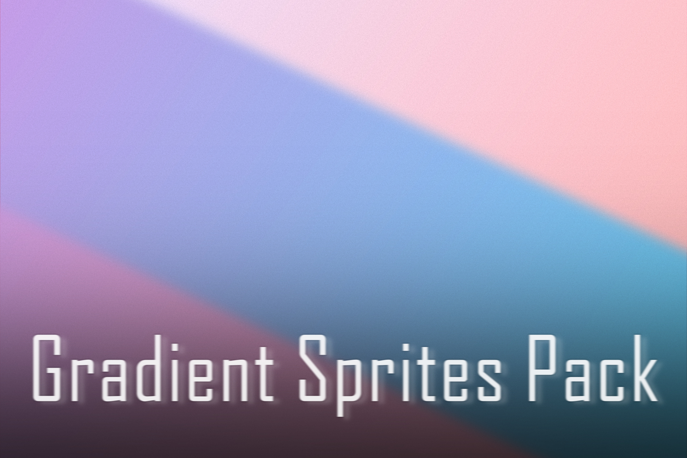
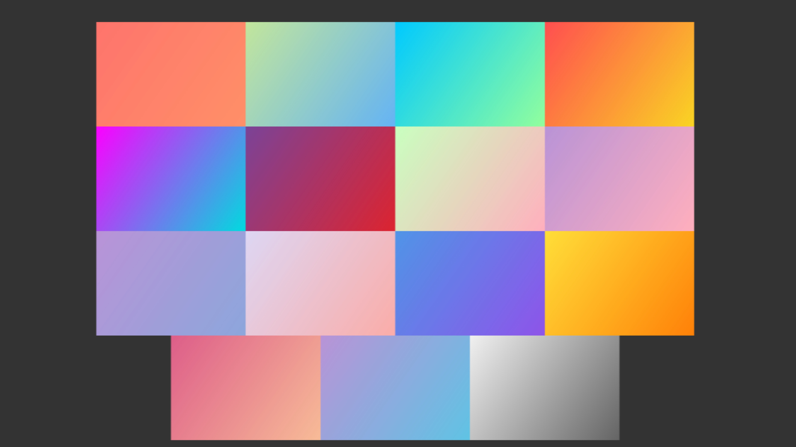
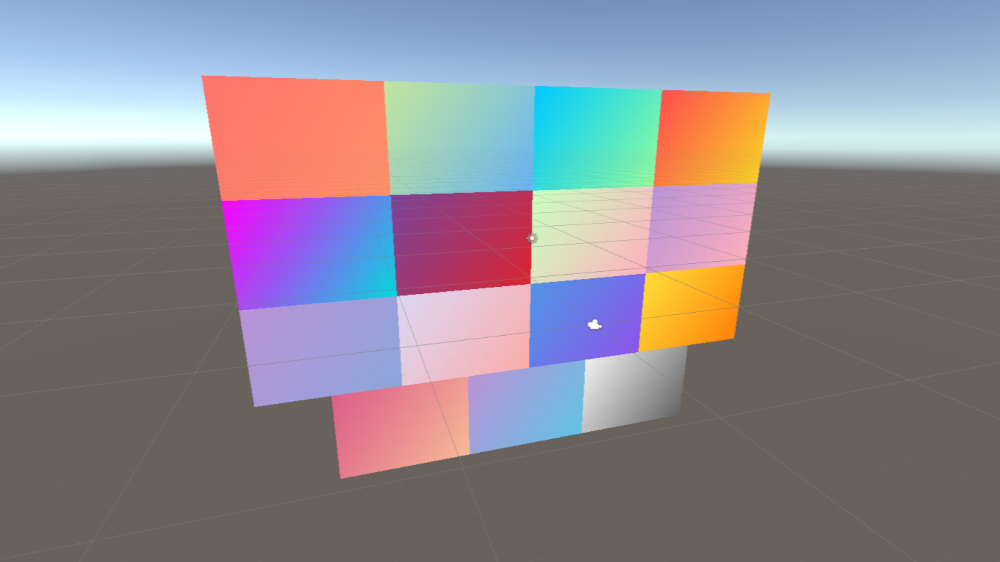

# GradientSpritesPack
Pack of 15 gradient sprites.

A gradient is a smooth color transition from one color to another. It can contain several color transitions. This free asset helps to create a beautiful UI in your game.

Supported platforms: Android/IOS/PC

File types: PNG

Sizes: 1000x700

Documentation: Included

# Screenshots

